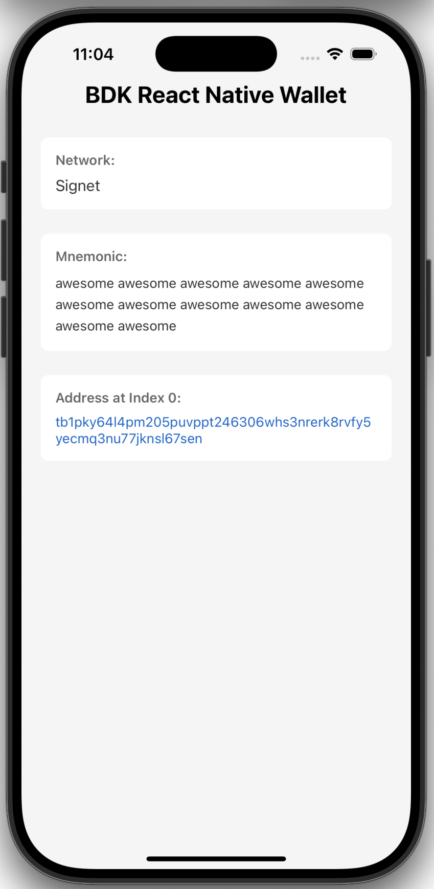
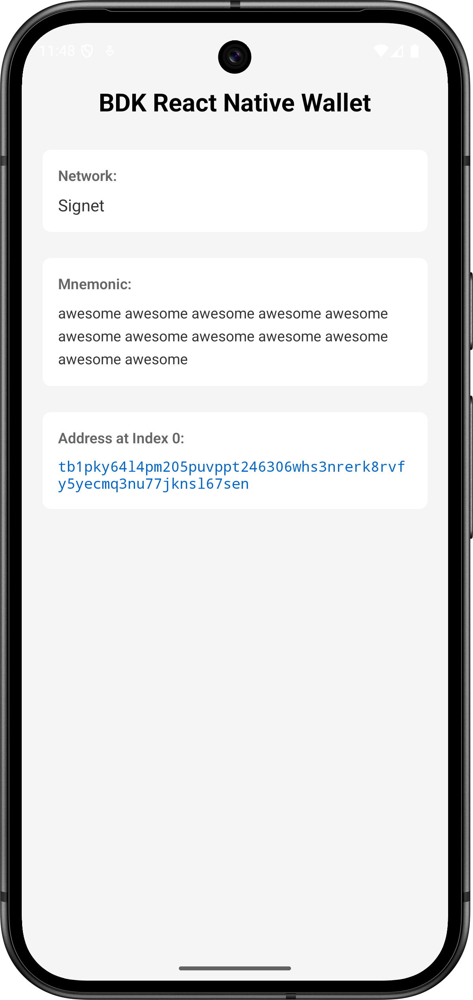

# Readme

This repository hosts example Android and iOS applications for the [bdk-rn](https://github.com/bitcoindevkit/bdk-rn) library.

[Read our docs](https://bitcoindevkit.github.io/bdk-rn/example-apps/) for the workflow required to get both apps working locally.

<div style="display: flex; gap: 1rem; flex-wrap: wrap;">
  
  
</div>

## Building the Apps

You can easily run our example Android and iOS applications without building the bdk-rn library from source simply by using one of the artifact library tarballs on our release pages.

1. Clone the [bdk-rn-example-apps](https://github.com/thunderbiscuit/bdk-rn-example-apps) repository.
2. Download a pre-built tarball from our [GitHub Releases](https://github.com/bitcoindevkit/bdk-rn/releases) and put it at the root of the repository.
3. Follow along the next sections to build either the iOS or the Android app and launch it locally.

### Running the iOS App

**Prerequisite:** CocoaPods >= `1.13` (`brew install cocoapods` should do it). 

```shell
git clone git@github.com:thunderbiscuit/bdk-rn-example-apps.git
cd bdk-rn-example-apps/
npm install
cd ios/
pod install
npm run ios
```

### Running the Android App

```shell
git clone git@github.com:thunderbiscuit/bdk-rn-example-apps.git
cd bdk-rn-example-apps/
npm install

# Start an Android emulator, then run
npm run android
```
